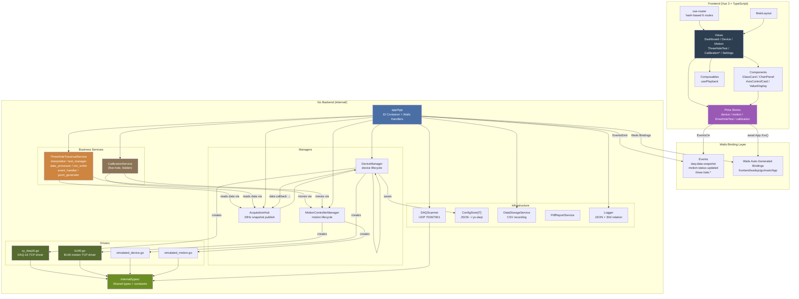

# YX-DAQ 架构文档

> 基于代码知识图谱（3038 symbols, 6448 edges, 154 execution flows）生成。
> 最后更新: 2026-05-03

---

## 概览

YX-DAQ 是 Windows-only Wails v2 桌面应用（Go 1.23 + Vue 3 + TypeScript），用于多通道数据采集、运动控制、及探针校准测试。

**核心能力**:
- 实时采集（DAQ-16 TCP, ~20Hz 推送）
- 运动控制（B140 TCP, 4 轴: X/Y/Z/U）
- 三孔探针移位插值测试（矩形/直线/自定义布点）
- 五孔探针校准（隐藏态，编码器补偿 + 球罐闸门）
- UDP 设备发现、CSV/PDF 导出、JSON 配置持久化

---

## 架构总览



---

## 功能领域

### 1. 采集设备管理 (`internal/driver/xy_daq16.go`, `internal/manager/device_manager.go`)

| 组件 | 职责 | 关键方法 |
|------|------|---------|
| `XYDAQDriver` | DAQ-16 TCP 连接、帧解析、自动重连 | `Connect`, `StartAcquisition`, `SetUnit` |
| `SimulatedDevice` | 开发/测试用模拟设备 | 正弦波/噪声数据生成 |
| `DeviceManager` | 配置管理、连接/采集生命周期 | `AddProfile`, `Connect`, `StartAcquisition`, `SetDataSink` |

**数据帧格式**: 16/18 通道 float32 二进制帧，通过 TCP 流接收。
**两种模式**: DAQ8 (8 压力通道) / DAQ16 (16 压力通道)，各 +2 (大气压 + 大气温度)。

### 2. 运动控制 (`internal/driver/b140.go`, `internal/manager/motion_manager.go`)

| 组件 | 职责 | 关键方法 |
|------|------|---------|
| `B140Driver` | Galil DMC-B140-M TCP 命令通信 | `SendCommand`, `ReceiveResponse` |
| `B140MotionController` | 高层面轴控制，实现 `MotionController` 接口 | `MoveTo`, `MoveBy`, `Jog`, `Home`, `GetAllAxisStatus` |
| `MotionControllerManager` | 多控制器生命周期、10Hz 状态轮询 | `Connect`, `MoveTo`, `StartPolling` |

**轴约定**: X=紫(线性), Y=青(线性), Z=绿(线性), U=橙(旋转)。
**状态轮询**: 后台 goroutine 每 100ms 查询所有轴状态 → 缓存 → `motion:status-updated` 事件推送。

### 3. 数据采集中枢 (`internal/manager/acquisition_hub.go`)

单 goroutine 定时器驱动（默认 20Hz），收集所有设备最新数据帧 → `daq:data-snapshot` 事件。

```
DeviceDriver → data callback → DeviceManager → dataSink → AcquisitionHub.OnData()
                                                              ↓ 20Hz tick
                                                      onSnapshot → wails EventsEmit
```

### 4. 三孔移位插值测试 (`internal/three_hole/`)

| 子组件 | 文件 | 职责 |
|--------|------|------|
| `ThreeHoleTraversalService` | `service.go` | 测试生命周期 (Start/Pause/Resume/Stop) + 主循环 |
| `TestManager` | `test_manager.go` | 状态管理、暂停/停止协调、进度发射 |
| `DataProcessor` | `data_processor.go` | 单点数据采集 (运动 → 驻留 → 采样 → 3-sigma 滤波) |
| `ThreeHoleInterpolator` | `interpolator.go` | 三孔插值算法 (已知校准表 → 攻角/马赫数迭代) |
| `PointGenerator` | `point_generator.go` | 矩形/直线/自定义布点坐标生成 |
| `EventHandler` | `event_handler.go` | 事件发射路由 + CSV 写入编排 |
| `ThreeHoleCsvWriter` | `csv_writer.go` | 结果 CSV 导出 |

**测试主循环**:
```
generatePoints(layout)
  ↓
for each point:
  wait if paused
  DataProcessor.RunSinglePoint(point)
    → MoveTo(alpha, beta)
    → WaitForMotionComplete
    → Dwell
    → Sample N times (3-sigma filter)
    → Interpolate(P1, P2, P3, PAtm, TAtm)
    → return ThreeHoleTraversalDataPoint
  ↓
EventHandler.OnDataPointAcquired(dataPoint)
  → EmitProgress / EmitRealtime events
  → CSV writer append
```

### 5. 五孔探针校准 (`internal/calibration/`)

当前隐藏但已实现。与三孔测试结构平行，但使用不同公式和流程：
- 编码器补偿状态机（迭代逼近目标位置）
- 球罐闸门控制（通道阈值触发）
- 5 孔系数计算（Kalpha, Kbeta, CPT, CPS）

### 6. 设备发现 (`internal/scanner/daq_scanner.go`)

UDP 广播扫描 (7000→7001)，解析设备响应 (IP/MAC/SN/Firmware/Port/Mask/Gateway)。

### 7. 数据持久化 (`internal/storage/`)

| 组件 | 格式 | 用途 |
|------|------|------|
| `ConfigStore[T]` | JSON `~/.yx-daq/` | 设备配置、运动配置、存储路径 |
| `DataStorageService` | CSV | 实时数据录制 |
| `PdfReportService` | PDF | 测试报告导出 |

### 8. 前端 (`frontend/src/`)

| 层 | 文件 | 职责 |
|----|------|------|
| `views/` | 6 个页面组件 | 页面编排、业务逻辑组合 |
| `stores/` | 4 个 Pinia store | 状态管理 + Wails API 调用 + 事件监听 |
| `components/` | GlassCard, ChartPanel 等 | 通用 UI 组件 |
| `composables/` | usePlayback | 跨组件逻辑复用 |
| `router/index.ts` | 6 条 hash 路由 | `/`, `/device`, `/motion`, `/calibration`, `/three-hole-test`, `/settings` |

---

## 关键执行流程

### Flow 1: 数据采集管道

```
[Hardware DAQ-16] --TCP binary frames--> XYDAQDriver
                                             ↓
                                       DeviceManager.dataSink
                                             ↓
                                    ┌────────┴────────┐
                                    ↓                   ↓
                          AcquisitionHub        DataStorageService
                          (OnData + cache)      (CSV recording)
                                    ↓
                          20Hz tick goroutine
                                    ↓
                         wails EventsEmit("daq:data-snapshot")
                                    ↓
                         frontend EventsOn → deviceStore.snapshots
                                    ↓
                         Dashboard/Device views re-render
```

### Flow 2: 三孔移位测试

```
User clicks "Start" in ThreeHoleTestView
  ↓
threeHoleTestStore → App.StartThreeHoleTraversal(config)
  ↓
App handler:
  1. Validate config
  2. Auto-start device acquisition if not running
  3. Auto-connect motion controller if not connected
  ↓
ThreeHoleTraversalService.Start(config)
  ↓
go runTestLoop():
  points = generatePoints(layout)
  for each point:
    DataProcessor.RunSinglePoint:
      moveMotion(alpha, beta)
      waitMotionComplete
      dwell
      sample N (3-sigma filter)
      interpolate(P1,P2,P3,PAtm,TAtm)
      return dataPoint
    EventHandler.OnDataPointAcquired:
      → EmitRealtime (events)
      → CSV write
  After loop:
    → EmitComplete
```

### Flow 3: 运动控制命令

```
[MotionView UI] → motionStore.jog('X', 1, 50)
  ↓
App.MotionJog("b140-mc-1", "X", 1, 50)
  ↓
MotionControllerManager.Jog("b140-mc-1", "X", 1, 50)
  ↓
B140MotionController.Jog("X", 1, 50)
  ↓
B140Driver.SendCommand("JG X=50000")  ← 实际 B140 命令
  ↓
  B140 hardware moves X axis
```

### Flow 4: 设备发现与配置

```
[DeviceView] → deviceStore.scan()
  ↓
App.ScanDevices(timeoutMs)
  ↓
DAQScanner.Scan():
  listen UDP :7001
  broadcast "psi9000" to UDP :7000
  collect responses
  ↓
return []DiscoveredDevice → frontend
  ↓
User adds device → deviceStore.addProfile(profile)
  ↓
App.AddDeviceProfile(profile)
  ↓
DeviceManager.AddProfile → ConfigStore.Save (JSON)
```

### Flow 5: 应用生命周期

```
main.go → wails.Run():
  OnStartup:
    App.Startup(ctx):
      1. Init logger
      2. Load JSON config (configManager.LoadAll)
      3. Set data pipeline: DeviceManager → AcquisitionHub + DataStorage
      4. Init device manager (load profiles, auto-connect)
      5. Init motion manager (load profiles, auto-connect)
      6. Init calibration service (hidden)
      7. Init three-hole service
      8. Start AcquisitionHub goroutine (20Hz publish)
      9. Start motion status broadcast goroutine

  OnShutdown:
    App.Shutdown(ctx):
      1. Stop three-hole service
      2. Wait for CSV flush (max 10s)
      3. Stop data recording
      4. Stop all acquisition
      5. Save all profiles to JSON config
      6. Close logger
```

---

## 依赖关系

```
types (zero deps)
  ← driver (types)
  ← scanner (types)
  ← storage (types)
  ← manager (types, driver, storage)
  ← calibration (types, manager via callback injection)
  ← three_hole (types)
  ← logger (types)
  ← app (ALL internal packages, DI coordinator)

app/App is the ONLY package that imports every other package.
No circular dependencies allowed.
```

## 模块统计

| 包 | 文件数 | 关键行数 |
|----|--------|---------|
| `internal/types/` | 6 | ~350 |
| `internal/driver/` | 4 | ~1400 (b140.go: 763, xy_daq16.go: 516) |
| `internal/manager/` | 5 | ~1100 |
| `internal/three_hole/` | 9 | ~1200 |
| `internal/calibration/` | 4 | ~500 |
| `internal/storage/` | 4 | ~500 |
| `internal/scanner/` | 1 | ~150 |
| `internal/app/` | 8 | ~800 |
| `frontend/src/views/` | 6 | ~2500 |
| `frontend/src/stores/` | 4 | ~1300 |

---

## 约定速查

| 类别 | 规范 |
|------|------|
| 事件命名 | `<domain>:<action>` (e.g., `daq:data-snapshot`, `three-hole:progress`) |
| 服务生命周期 | `Start` → `Pause` → `Resume` → `Stop` |
| 轴色 | X=紫(#purple), Y=青(#cyan), Z=绿(#green), U=橙(#orange) |
| 配置存储 | `~/.yx-daq/` JSON |
| 前端环境 | Vitest + happy-dom |
| Wails 绑定 | `frontend/wailsjs/` 自动生成，禁止手动编辑 |
